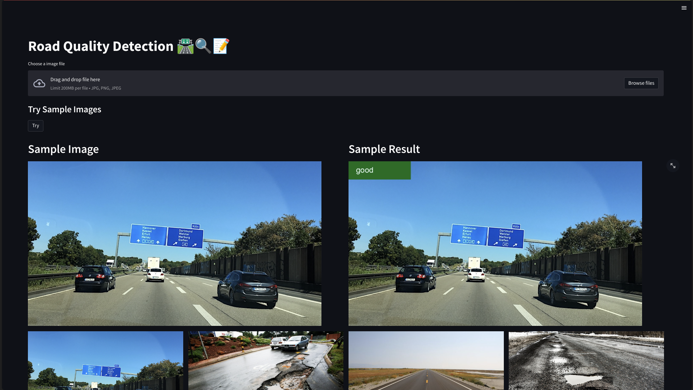

# Road Quality Detection

This project aims to detect the quality of roads in images using a Convolutional Neural Network (CNN) model. It provides a Streamlit-based user interface to upload an image and visualize the predicted road quality.

## App Example




## Prerequisites

Before running the code, ensure that you have the following dependencies installed:

- Python 3.x
- Streamlit
- OpenCV
- PyTorch
- scikit-learn
- Pillow (PIL)
- torchvision
- matplotlib

You can install the required dependencies by running the following command:

```python
pip install -r requirements.txt
```

## Project Structure

The project is organized into multiple files for better code organization and separation of concerns:

- `main.py`: Contains the Streamlit application code responsible for uploading the image, invoking the prediction, and displaying the results.
- `image_utils.py`: Provides utility functions for image preprocessing, prediction, and drawing the prediction on the image.
- `road_quality_classifier.py`: Defines the CNN architecture for road quality classification.
- `model`: CNN Model for road quality classification inference
- `test_image`: Sample images
- 'https://www.kaggle.com/code/diwash1/road-quality-classification' : Code and data for the model creation

## Usage

To run the application, execute the following command:

```python
streamlit run main.py
```

This will start the Streamlit server, and you can access the application in your web browser.

1. Click on the "Choose a image file" button to select an image file (supported formats: jpg, png, jpeg).
2. Once you select an image, the application will display the uploaded image on the left side.
3. The application will then predict the road quality based on the uploaded image using the pre-trained CNN model.
4. The predicted road quality class will be displayed on the right side along with the image where the prediction is drawn.

Note: Make sure to provide the correct path to the pre-trained model file in the `road_quality_classifier.py` file.
